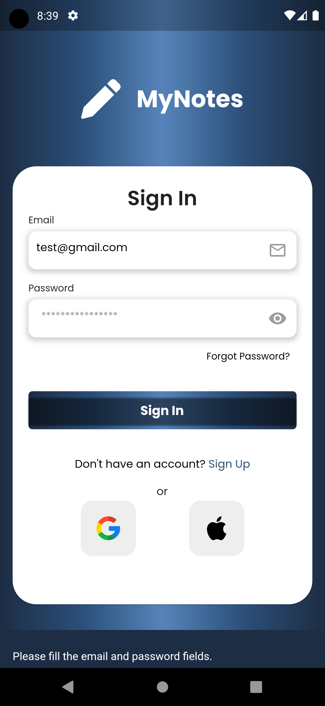

# MyNotes

MyNotes is a Flutter application that allows users to sign up, log in, write their notes, and perform basic CRUD operations on their notes.

## Getting Started

This project is a starting point for a Flutter application using the Bloc state management pattern.

### Prerequisites

Before running the application, make sure you have Flutter installed on your machine. If not, you can follow the installation instructions on the [official Flutter website](https://flutter.dev/docs/get-started/install).

### Installing

1. Clone the repository to your local machine:

   ```bash
   git clone https://github.com/amirov_sunnat/mynotes.git

## Features
# User Authentication:

Sign up with a new account.
Log in with an existing account.
# Note Management:

Create new notes.
View a list of existing notes.
Modify and update notes.
Delete notes.
## Project Structure
The project follows a standard Flutter project structure. Key directories include:

- lib/: Contains the main source code for the Flutter application.
- bloc/: Houses the BLoC (Business Logic Component) classes.
- data/: Manages data sources and repositories.
- ui/: Defines the user interface components.
## Dependencies
- Bloc: State management library for Flutter applications.


Feel free to customize the README according to the specifics of your project. This template provides a basic structure with sections for getting started, features, project structure, dependencies, contributing guidelines, and licensing information.


<!-- Add Screenshots -->
## Screenshots

## Screenshots


*Caption for Screenshot 1.*


*Caption for Screenshot 2.*


*Caption for Screenshot 3.*


*Caption for Screenshot 4.*


*Caption for Screenshot 5.*


*Caption for Screenshot 6.*


*Caption for Screenshot 7.*


*Caption for Screenshot 8.*


*Caption for Screenshot 9.*


*Caption for Screenshot 10.*


*Caption for Screenshot 11.*


*Caption for Screenshot 12.*


*Caption for Screenshot 13.*


*Caption for Screenshot 14.*


*Caption for Screenshot 15.*


*Caption for Screenshot 16.*


*Caption for Screenshot 17.*


*Caption for Screenshot 18.*


*Caption for Screenshot 19.*